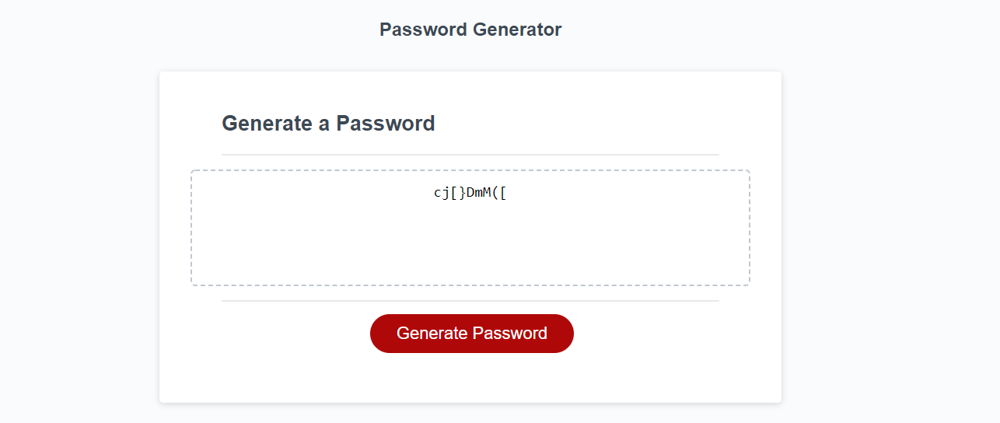

# Password Generator

## About the Password Generator

This Password Generator allows users to input the number of characters their password should be, and confirm whether the password should contain special characters, numbers, lowercase letters and/or uppercase letters.
A few validations have been put in place to ensure that:

1. A number was entered between 8-128
2. At least one character type is selected.

Users can exit out of the prompt at the start if they wish to. 

Javascript, together with HTML and CSS was used to create the deployed application on Github.

## Preview of the Password Generator 

## Link to Deployed Application

https://annanguyen1.github.io/Password-Generator/
